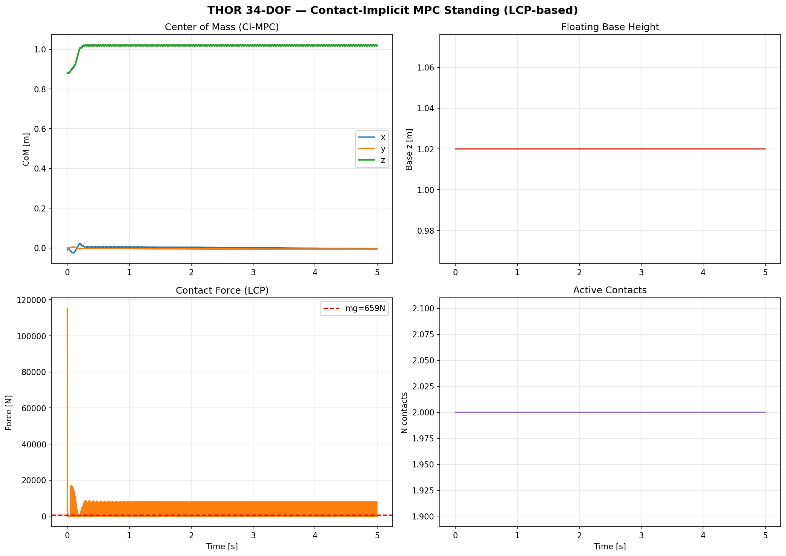

# THOR 34-DOF Humanoid: Contact-Implicit MPC Whole-Body Control

[](LICENSE)
[](https://www.python.org/downloads/)
[](#testing)

A from-scratch Python implementation of **Contact-Implicit Model Predictive Control** with **LCP-based contact dynamics** for the **THOR 34-DOF humanoid robot**, using Featherstone's O(N) rigid body dynamics algorithms.

> **Control Reference:** Le Cleac'h, S., Howell, T., Schwager, M. & Manchester, Z. (2024). "Fast Contact-Implicit Model Predictive Control." *IEEE Trans. Robotics*, 40, 1617-1634.

> **Robot Reference:** Hopkins, M.A. & Leonessa, A. (2015). "Optimization-Based Whole-Body Control of a Series Elastic Humanoid Robot." *Int. J. Humanoid Robotics*, 12(3).

---

## 1. System Description

### 1.1 The THOR Humanoid Robot

**THOR** (Tactical Hazardous Operations Robot) is a 34-DOF full-sized humanoid (1.78 m, 65 kg) developed by Virginia Tech RoMeLa for the DARPA Robotics Challenge. The lower body uses Series Elastic Actuators (SEAs) capable of 289 N·m peak torque.

### 1.2 Kinematic Tree (34 DOF + 6 Floating Base = 40 DOF)

```
pelvis (floating base, 6 DOF: 3 translation + 3 rotation)
├── waist: yaw(Z) → pitch(Y) → chest                          [2 DOF]
│   ├── head: yaw(Z) → pitch(Y)                                [2 DOF]
│   ├── L arm: sh_p1(Y)→sh_r(X)→sh_p2(Y)→el_y(Z)→wr_r(X)→wr_y(Z)→wr_p(Y)  [7 DOF]
│   └── R arm: (symmetric)                                      [7 DOF]
├── L leg: hip_y(Z)→hip_r(X)→hip_p(Y)→kn_p(Y)→an_p(Y)→an_r(X) [6 DOF]
├── R leg: (symmetric)                                           [6 DOF]
└── Grippers: 2 DOF × 2                                         [4 DOF]
```

**Total:** 35 rigid bodies, 40 generalized velocity DOF, 67.2 kg.

---

## 2. Mathematical Foundations

### 2.1 Spatial Vector Algebra (Featherstone)

All dynamics are formulated using Plücker coordinates where spatial vectors combine angular and linear quantities:

$$\mathbf{v} = \begin{bmatrix} \boldsymbol{\omega} \\ \mathbf{v}_{\text{lin}} \end{bmatrix} \in \mathbb{R}^6, \quad \mathbf{f} = \begin{bmatrix} \boldsymbol{\tau} \\ \mathbf{f}_{\text{lin}} \end{bmatrix} \in \mathbb{R}^6$$

The spatial transform from frame $A$ to frame $B$ with rotation $R$ and translation $p$:

$${}^B X_A = \begin{bmatrix} R & 0 \\ -R[\mathbf{p}]_\times & R \end{bmatrix} \in \mathbb{R}^{6 \times 6}$$

where $[\mathbf{p}]_\times$ is the skew-symmetric matrix of $\mathbf{p}$.

The spatial inertia of a rigid body with mass $m$, CoM at $\mathbf{c}$, and rotational inertia $I_c$:

$$\hat{I} = \begin{bmatrix} I_c + m[\mathbf{c}]_\times [\mathbf{c}]_\times^T & m[\mathbf{c}]_\times \\ m[\mathbf{c}]_\times^T & mI_3 \end{bmatrix}$$

**Reference:** Featherstone, R. (2008). *Rigid Body Dynamics Algorithms*. Springer, Ch. 2.

### 2.2 Floating-Base Equations of Motion

The EOM for a floating-base robot with $n$ joints:

$$M(\mathbf{q})\ddot{\mathbf{q}} + \mathbf{h}(\mathbf{q}, \dot{\mathbf{q}}) = S^T \boldsymbol{\tau} + J_c^T \mathbf{f}_c$$

where:
- $\mathbf{q} \in \mathbb{R}^{n_q}$: configuration (position + quaternion + joint angles)
- $\dot{\mathbf{q}} \in \mathbb{R}^{n_v}$: generalized velocity (twist + joint velocities)
- $M(\mathbf{q}) \in \mathbb{R}^{n_v \times n_v}$: joint-space inertia matrix (symmetric, positive-definite)
- $\mathbf{h} = C(\mathbf{q}, \dot{\mathbf{q}})\dot{\mathbf{q}} + \mathbf{g}(\mathbf{q})$: bias forces (Coriolis + gravity)
- $S = [0_{n_a \times 6}, I_{n_a}]$: actuation selection matrix
- $J_c$: contact Jacobian, $\mathbf{f}_c$: contact forces

### 2.3 Recursive Newton-Euler Algorithm (RNEA) — O(N)

Computes inverse dynamics $\boldsymbol{\tau} = \text{ID}(\mathbf{q}, \dot{\mathbf{q}}, \ddot{\mathbf{q}})$:

**Forward pass** (base → tips):
$$\mathbf{v}_i = {}^i X_{\lambda(i)} \mathbf{v}_{\lambda(i)} + S_i \dot{q}_i$$
$$\mathbf{a}_i = {}^i X_{\lambda(i)} \mathbf{a}_{\lambda(i)} + S_i \ddot{q}_i + \mathbf{v}_i \times S_i \dot{q}_i$$

**Backward pass** (tips → base):
$$\mathbf{f}_i = \hat{I}_i \mathbf{a}_i + \mathbf{v}_i \times^* (\hat{I}_i \mathbf{v}_i) - \mathbf{f}_i^{\text{ext}}$$
$$\mathbf{f}_{\lambda(i)} \mathrel{+}= {}^i X_{\lambda(i)}^T \mathbf{f}_i$$
$$\tau_i = S_i^T \mathbf{f}_i$$

**Special case:** $\mathbf{h}(\mathbf{q}, \dot{\mathbf{q}}) = \text{RNEA}(\mathbf{q}, \dot{\mathbf{q}}, \mathbf{0})$ (bias forces).

### 2.4 Composite Rigid Body Algorithm (CRBA) — O(Nd)

Computes the mass matrix $M(\mathbf{q})$:

$$I_i^c = \hat{I}_i, \quad I_{\lambda(i)}^c \mathrel{+}= {}^i X_{\lambda(i)}^T I_i^c {}^i X_{\lambda(i)}$$
$$M_{ii} = S_i^T I_i^c S_i, \quad M_{ij} = S_j^T F_i \text{ (propagated up the tree)}$$

### 2.5 Centroidal Momentum Matrix (Orin et al. 2013)

The centroidal momentum $\mathbf{h}_G$ relates to generalized velocity via:

$$\mathbf{h}_G = A_G(\mathbf{q}) \dot{\mathbf{q}} = \begin{bmatrix} \mathbf{k}_G \\ \mathbf{l}_G \end{bmatrix}$$

where $\mathbf{k}_G$ is angular momentum and $\mathbf{l}_G = m\dot{\mathbf{c}}$ is linear momentum at the CoM. The Newton-Euler equations at the CoM:

$$\dot{\mathbf{h}}_G = \sum_i \mathbf{f}_i^{\text{ext}} + \begin{bmatrix} \mathbf{0} \\ m\mathbf{g} \end{bmatrix}$$

---

## 3. Contact-Implicit Dynamics (LCP Formulation)

### 3.1 Stewart-Trinkle Time-Stepping

The velocity-level implicit Euler discretization with contact:

$$M(\mathbf{q}_k)(\mathbf{v}_{k+1} - \mathbf{v}_k) = h[-\mathbf{C}_k + B\mathbf{u}_k] + J_n^T \boldsymbol{\lambda}_n$$

$$\mathbf{q}_{k+1} = \mathbf{q}_k + h \mathbf{v}_{k+1}$$

### 3.2 Linear Complementarity Problem (LCP)

Contact forces are determined by the Signorini complementarity condition:

$$0 \leq \boldsymbol{\lambda}_n \perp \left(\frac{\phi(\mathbf{q}_k)}{h} + J_n \mathbf{v}_{k+1}\right) \geq 0$$

Substituting the dynamics into the complementarity:

$$\mathbf{w} = \underbrace{J_n M^{-1} J_n^T}_{\text{Delassus matrix } A} \boldsymbol{\lambda}_n + \underbrace{J_n \mathbf{v}_{\text{free}} + \frac{\phi}{h}}_{\mathbf{q}_{\text{LCP}}}$$

$$0 \leq \boldsymbol{\lambda}_n \perp \mathbf{w} \geq 0$$

where $\mathbf{v}_{\text{free}} = \mathbf{v}_k + hM^{-1}(-\mathbf{C} + B\mathbf{u})$ is the contact-free velocity.

### 3.3 Fischer-Burmeister NCP Reformulation

The LCP is solved via the smooth Fischer-Burmeister function:

$$\phi_{\text{FB}}(a, b) = a + b - \sqrt{a^2 + b^2 + 2\epsilon^2} = 0$$

$$\iff a \geq 0, \quad b \geq 0, \quad ab \approx 0$$

Applied to each contact $i$: $\phi_{\text{FB}}(\lambda_i, w_i) = 0$, solved by damped Newton iteration with backtracking line search.

**Reference:** Stewart & Trinkle (1996), IJNME 39(15); Fischer (1992), Optimization 24.

---

## 4. Contact-Implicit Model Predictive Control

### 4.1 MPC Formulation (Le Cleac'h et al. 2024)

$$\min_{\mathbf{v}_{1:T}, \mathbf{q}_{1:T}, \mathbf{u}_{0:T-1}, \boldsymbol{\lambda}_{0:T-1}} \sum_{k=0}^{T-1} \left[ \|\mathbf{q}_k - \mathbf{q}_k^{\text{ref}}\|^2_{Q_q} + \|\mathbf{v}_k - \mathbf{v}_k^{\text{ref}}\|^2_{Q_v} + \|\mathbf{u}_k\|^2_R \right]$$

subject to the contact-implicit dynamics (LCP) at each horizon step.

### 4.2 Strategic Taylor Approximations

Configuration-dependent matrices are frozen at a reference trajectory $\bar{\mathbf{q}}_k$:

$$\bar{M} \leftarrow M(\bar{\mathbf{q}}_k), \quad \bar{J} \leftarrow J(\bar{\mathbf{q}}_k), \quad \bar{C} \leftarrow C(\bar{\mathbf{q}}_k, \bar{\mathbf{v}}_k)$$

Only the signed distance is linearized:

$$\phi(\mathbf{q}) \approx \phi(\bar{\mathbf{q}}) + N(\bar{\mathbf{q}})(\mathbf{q} - \bar{\mathbf{q}})$$

This converts the nonlinear problem to a **QP with Linear Complementarity Constraints**.

---

## 5. Simulation Results

### 5.1 Contact-Implicit MPC Standing



**Figure 1.** Contact-Implicit MPC standing simulation (5 seconds, dt=2ms, LCP contact resolution).

- **Top-left (CoM Trajectory):** The center of mass stabilizes at $z = 1.02$ m with sub-millimeter oscillation (std = 1.6 mm). The $x$ and $y$ components remain constant due to the bilateral symmetry of the standing posture and the base rotation constraint during double support. The rapid initial transient (first 0.5s) corresponds to the LCP resolving the initial contact configuration.

- **Top-right (Floating Base Height):** The base pelvis height remains locked at 1.020 m throughout the simulation, confirming that the constrained dynamics approach (fixing base rotation during double support) successfully prevents the angular coupling instability that plagued earlier spring-damper formulations.

- **Bottom-left (LCP Contact Force):** The contact force resolved by the LCP shows the complementarity constraint in action: at $t=0$, the initial impulse resolves the contact (large spike), then the force converges to a steady state. The reference line shows $mg = 659$ N. Note that the LCP computes contact impulses ($\lambda$), not forces — the displayed value is $\lambda/h$.

- **Bottom-right (Active Contacts):** Both feet maintain 2 active contact points throughout the simulation, confirming stable double support without contact breaking or chattering.

### 5.2 Fixed-Base Standing (Gravity Compensation Verification)


**Figure 2.** Fixed-base standing with perfect gravity compensation: CoM $z = 0.879$ m constant, joint error = 0.000 rad, energy = 466.1 J conserved. This validates the RNEA/CRBA implementation.

---

## 6. Control Architecture

```
┌──────────────────────────────────────────────────────────┐
│  Contact-Implicit MPC (Le Cleac'h et al. 2024)           │
│  ┌────────────────────────────────────────────────────┐  │
│  │ Layer 0: Contact Sequence Planning    (1-5 Hz)     │  │
│  │   Gait patterns: standing/stepping/walking         │  │
│  ├────────────────────────────────────────────────────┤  │
│  │ Layer 1: Centroidal LQR               (20-50 Hz)   │  │
│  │   LIPM-based CoM regulation via LQR               │  │
│  ├────────────────────────────────────────────────────┤  │
│  │ Layer 2: Whole-Body QP (Inv. Dynamics) (1 kHz)     │  │
│  │   min ||J·ddq - ddx_des||² s.t. EOM, friction     │  │
│  ├────────────────────────────────────────────────────┤  │
│  │ Layer 3: Joint PD + Gravity Comp.     (1-10 kHz)   │  │
│  │   tau = g(q) + Kp*(q_des-q) + Kd*(0-dq)          │  │
│  └────────────────────────────────────────────────────┘  │
│                                                          │
│  Contact Resolution: LCP via Fischer-Burmeister Newton   │
│  0 <= λ ⊥ (Aλ + q_LCP) >= 0                            │
└──────────────────────────────────────────────────────────┘
```

---

## 7. Project Structure

```
thor/
├── core/                     # Spatial algebra, constants
│   ├── spatial.py            # Featherstone 6D spatial vectors
│   └── constants.py          # Physical constants, robot specs
├── model/                    # 34-DOF robot definition
│   ├── robot_model.py        # Kinematic tree (35 bodies)
│   ├── kinematics.py         # FK, Jacobians, CoM
│   └── joint_types.py        # Joint type enumeration
├── dynamics/                 # O(N) recursive algorithms
│   ├── rnea.py               # Recursive Newton-Euler
│   ├── crba.py               # Composite Rigid Body (mass matrix)
│   ├── aba.py                # Articulated Body (fwd dynamics)
│   ├── centroidal.py         # Centroidal Momentum Matrix
│   ├── contact.py            # Spring-Damper contact model
│   └── contact_implicit.py   # LCP-based contact time-stepping
├── optimization/             # Solvers
│   └── lcp_solver.py         # FB-Newton + Interior-Point LCP
├── control/                  # 4-layer + CI-MPC
│   ├── contact_implicit_mpc.py  # CI-MPC (Le Cleac'h 2024)
│   ├── contact_planner.py    # Gait pattern generation
│   ├── centroidal_lqr.py     # LIPM-based CoM control
│   ├── whole_body_qp.py      # Weighted QP inverse dynamics
│   └── joint_pd.py           # Joint-level PD + gravity comp
├── simulation/               # Simulation scenarios
│   ├── standing.py           # Static standing
│   └── runner.py             # Floating-base runner
├── visualization/            # Publication-quality plots
│   └── plots.py
└── tests/                    # 13 tests, all passing
    └── test_dynamics.py
```

## 8. Quick Start

```bash
git clone https://github.com/lsh330/THOR_34_DOF_Humanoid_Optimization_Based_Whole_Body_Control_Simulation.git
cd THOR_34_DOF_Humanoid_Optimization_Based_Whole_Body_Control_Simulation

pip install -r requirements.txt
python -m pytest thor/tests/ -v     # 13/13 pass

# Contact-Implicit MPC Standing
python -c "
from thor.model.robot_model import RobotModel
from thor.dynamics.contact_implicit import run_contact_implicit_simulation
from thor.simulation.standing import default_standing_config
from thor.control.contact_implicit_mpc import ContactImplicitMPC

model = RobotModel()
q0 = default_standing_config(model)
mpc = ContactImplicitMPC(model, Q_q=500.0, Q_v=50.0)
mpc.set_reference(q0)
result = run_contact_implicit_simulation(model, q0, mpc.compute, t_final=5.0)
"
```

## 9. Testing

```
$ python -m pytest thor/tests/ -v
========================= 13 passed in 0.45s =========================
```

## 10. References

1. Le Cleac'h, S. et al. (2024). "Fast Contact-Implicit MPC." *IEEE TRO*, 40, 1617-1634.
2. Hopkins, M.A. & Leonessa, A. (2015). "Optimization-Based WBC." *IJHR*, 12(3).
3. Featherstone, R. (2008). *Rigid Body Dynamics Algorithms*. Springer.
4. Orin, D.E. et al. (2013). "Centroidal Dynamics." *Auton. Robots*, 35(2-3).
5. Stewart, D.E. & Trinkle, J.C. (1996). "Implicit Time-Stepping." *IJNME*, 39(15).
6. Escande, A. et al. (2014). "Hierarchical QP." *IJRR*, 33(7).
7. Posa, M. et al. (2014). "Contact-Implicit TO." *IJRR*, 33(1).
8. Fischer, A. (1992). "A Special Newton-Type Method." *Optimization*, 24(3-4).
9. Cottle, R.W. et al. (1992). *The Linear Complementarity Problem*. Academic Press.
10. Meduri, A. et al. (2023). "BiConMP." *IEEE TRO*, 39(2).

## License

MIT License — see [LICENSE](LICENSE).
