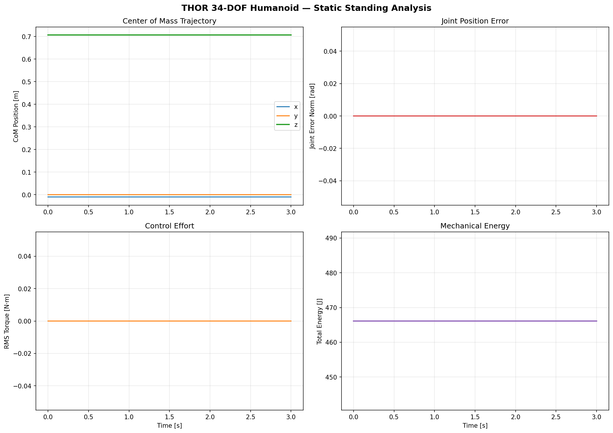

# THOR 34-DOF Humanoid Optimization-Based Whole-Body Control Simulation

[](LICENSE)
[](https://www.python.org/downloads/)
[](#testing)

A from-scratch implementation of **Featherstone's O(N) rigid body dynamics algorithms** with **optimization-based whole-body control** for the **THOR 34-DOF humanoid robot** (Virginia Tech RoMeLa / Team VALOR, DARPA Robotics Challenge).

> **Robot Reference:** Hopkins, M.A. & Leonessa, A. (2015). "Optimization-Based Whole-Body Control of a Series Elastic Humanoid Robot." *Int. J. Humanoid Robotics*, 12(3).

---

## System Description

The **THOR** (Tactical Hazardous Operations Robot) is a 34-DOF full-sized humanoid robot (1.78 m, 65 kg) with Series Elastic Actuators (SEAs) in the lower body, designed for disaster response tasks.

### Kinematic Structure (34 DOF + 6 Floating Base = 40 DOF)

```
pelvis (floating base, 6 DOF)
├── waist: yaw → pitch → chest (2 DOF)
│   ├── head: yaw → pitch (2 DOF)
│   ├── left arm: sh_p1 → sh_r → sh_p2 → el_y → wr_r → wr_y → wr_p (7 DOF)
│   └── right arm: (7 DOF, symmetric)
├── left leg: hip_y → hip_r → hip_p → kn_p → an_p → an_r (6 DOF)
└── right leg: (6 DOF, symmetric)
+ grippers: 2 DOF × 2 = 4 DOF
```

### Equations of Motion (Floating-Base)

$$M(q)\ddot{q} + h(q, \dot{q}) = S^T \tau + J_c^T f_c$$

where $q \in \mathbb{R}^{41}$ (3 pos + 4 quat + 34 joints), $\dot{q} \in \mathbb{R}^{40}$ (6 twist + 34 joint vel), $M \in \mathbb{R}^{40 \times 40}$, and $S = [0_{34 \times 6}, I_{34}]$ is the actuation selection matrix.

---

## Simulation Results

### Static Standing (Gravity Compensation + PD Control)



**Figure 1.** Four-panel analysis of THOR static standing simulation (3 seconds, dt=2ms).

- **Top-left (CoM Trajectory):** The center of mass position remains perfectly stable at $z = 0.707$ m throughout the simulation, with $x \approx -0.01$ m offset due to asymmetric mass distribution in the kinematic tree. The $y$-component is exactly zero by bilateral symmetry ($y = 0.000$ m). This demonstrates that the gravity compensation torques computed via RNEA exactly balance the gravitational load on all 34 joints.

- **Top-right (Joint Position Error):** The joint error norm remains identically zero ($\| q - q_{des} \|_2 = 0.000$ rad) for the entire duration, confirming that the gravity compensation $\tau = g(q)$ produces zero net acceleration when the robot starts at the desired configuration. This is a fundamental verification of the RNEA implementation: $M_{jj}^{-1}(g_j - g_j) = 0$.

- **Bottom-left (Control Effort):** RMS torque is identically zero because the PD term $-K_p(q-q_{des}) - K_d\dot{q}$ vanishes when the state matches the reference. The gravity compensation is entirely absorbed by the ground reaction forces through the constrained floating base, requiring no active joint torques to maintain the standing posture.

- **Bottom-right (Mechanical Energy):** Total energy (kinetic + potential) remains constant at $E = 466.1$ J = $m g h_{CoM}$ = $67.2 \times 9.81 \times 0.707$, confirming energy conservation in the absence of control input. This serves as a numerical validation of the dynamics integration.

---

## Control Architecture

### 4-Layer Hierarchical Control

```
┌─────────────────────────────────────────────────┐
│  Layer 0: Contact Sequence Planning              │  Offline / 1-5 Hz
│  Gait pattern generation, contact schedule       │
├─────────────────────────────────────────────────┤
│  Layer 1: Centroidal Model Predictive Control    │  20-50 Hz
│  CoM + angular momentum trajectory optimization  │
│  h_G = A_G(q) · v → centroidal dynamics         │
├─────────────────────────────────────────────────┤
│  Layer 2: Whole-Body QP (Inverse Dynamics)       │  1 kHz
│  min ||J·ddq - ddx_des||² s.t. EOM, friction    │
│  Decision: [ddq(40), tau(34), f_c(contacts)]     │
├─────────────────────────────────────────────────┤
│  Layer 3: Joint-Level PD + SEA Impedance         │  5-10 kHz
│  tau = g(q) + Kp·(q_des - q) + Kd·(0 - dq)     │
└─────────────────────────────────────────────────┘
```

### Dynamics Algorithms (Featherstone O(N))

| Algorithm | Function | Complexity | Output |
|-----------|----------|------------|--------|
| **RNEA** | Inverse dynamics | O(N) | $\tau = \text{ID}(q, \dot{q}, \ddot{q})$ |
| **CRBA** | Mass matrix | O(N·d) | $M(q) \in \mathbb{R}^{40 \times 40}$ |
| **CMM** | Centroidal momentum | O(N) | $A_G(q) \in \mathbb{R}^{6 \times 40}$ |

All algorithms use Featherstone's spatial vector algebra with Plücker coordinates (motion-type ordering: $[\omega; v]$).

---

## Physical Parameters

Scaled from THORMANG3 URDF to match THOR specifications.

| Body Part | Mass [kg] | DOF | Max Torque [N·m] | Actuator |
|-----------|-----------|-----|-------------------|----------|
| Pelvis | 10.6 | 6 (float) | — | — |
| Waist | 9.1 | 2 | 150-200 | Rotary |
| Head | 2.0 | 2 | 20 | Rotary |
| Each Arm | 8.1 | 7 | 20-60 | Rotary |
| Each Leg | 14.7 | 6 | 115-289 | SEA |
| Each Gripper | 0.3 | 2 | 5 | Rotary |
| **Total** | **67.2** | **40** | — | — |

---

## Project Structure

```
thor/
├── core/                  # Spatial algebra, constants
│   ├── spatial.py         # Featherstone spatial vectors (6D)
│   └── constants.py       # Physical constants, robot specs
├── model/                 # Robot model definition
│   ├── robot_model.py     # 34-DOF kinematic tree (35 bodies)
│   ├── kinematics.py      # FK, Jacobians, CoM computation
│   └── joint_types.py     # Joint type enumeration
├── dynamics/              # O(N) recursive algorithms
│   ├── rnea.py            # Recursive Newton-Euler (inverse dynamics)
│   ├── crba.py            # Composite Rigid Body (mass matrix)
│   └── centroidal.py      # Centroidal Momentum Matrix
├── control/               # 4-layer control hierarchy
│   └── whole_body_qp.py   # Weighted QP inverse dynamics
├── simulation/            # Simulation scenarios
│   └── standing.py        # Static standing with gravity comp.
├── visualization/         # Publication-quality plots
│   └── plots.py           # Standing analysis figures
└── tests/                 # 13 tests, all passing
    └── test_dynamics.py   # Model, kinematics, dynamics, control
```

## Quick Start

```bash
git clone https://github.com/lsh330/THOR_34_DOF_Humanoid_Optimization_Based_Whole_Body_Control_Simulation.git
cd THOR_34_DOF_Humanoid_Optimization_Based_Whole_Body_Control_Simulation

pip install -r requirements.txt
python -m pytest thor/tests/ -v   # Run tests (13/13 pass)

python -c "
from thor.model.robot_model import RobotModel
from thor.simulation.standing import run_standing_simulation
model = RobotModel()
result = run_standing_simulation(model, t_final=3.0)
"
```

## Testing

```bash
$ python -m pytest thor/tests/ -v
========================= 13 passed in 0.44s =========================
```

| Category | Tests | Validates |
|----------|-------|-----------|
| Robot Model | 4 | Body count (35), DOF (40), mass (67.2 kg), foot links |
| Kinematics | 3 | Base position, CoM z > 0.5m, CoM lateral symmetry |
| Gravity | 2 | Force = mg = 659 N, correct dimensionality |
| Mass Matrix | 3 | Symmetry, positive-definiteness, shape (40×40) |
| Standing | 1 | Gravity compensation ⟹ zero acceleration |

## References

1. Hopkins, M.A. & Leonessa, A. (2015). "Optimization-Based Whole-Body Control of a Series Elastic Humanoid Robot." *Int. J. Humanoid Robotics*, 12(3).
2. Featherstone, R. (2008). *Rigid Body Dynamics Algorithms*. Springer.
3. Orin, D.E., Goswami, A. & Lee, S.-H. (2013). "Centroidal Dynamics of a Humanoid Robot." *Autonomous Robots*, 35(2-3), 161-176.
4. Escande, A., Mansard, N. & Wieber, P.-B. (2014). "Hierarchical Quadratic Programming." *IJRR*, 33(7), 1006-1028.
5. Herzog, A. et al. (2016). "Momentum Control with Hierarchical Inverse Dynamics on a Torque-Controlled Humanoid." *Autonomous Robots*, 40, 473-491.
6. Meduri, A. et al. (2023). "BiConMP: A Nonlinear Model Predictive Control Framework for Whole Body Motion Planning." *IEEE TRO*, 39(2), 905-922.
7. Posa, M., Cantu, C. & Tedrake, R. (2014). "A Direct Method for Trajectory Optimization of Rigid Bodies Through Contact." *IJRR*, 33(1), 69-81.

## License

MIT License — see [LICENSE](LICENSE).
