# THOR 34-DOF 휴머노이드: 최적화 기반 전신 제어 시뮬레이션

[](LICENSE)
[](https://www.python.org/downloads/)
[](#11-테스트-및-검증)
[](#9-성능-최적화)

**접촉-내재적 모델 예측 제어 (Contact-Implicit MPC)**, **LCP 기반 접촉 역학**, 그리고 **Featherstone O(N) 강체 동역학**을 Python으로 처음부터 (from scratch) 구현한 **THOR 34-DOF 휴머노이드 로봇** 전신 제어 시뮬레이션이다. 운동 방정식, 동역학 알고리즘, 최적화 솔버 모두 제1원리(first principles)에서 도출하였으며 Pinocchio, Drake, MuJoCo 등 외부 동역학 라이브러리를 사용하지 않는다.

> 수학적 이론의 완전한 유도는 [docs/THEORY.md](docs/THEORY.md)를 참조한다.

---

## 목차

1. [프로젝트 개요](#1-프로젝트-개요)
2. [주요 기여점 및 성과](#2-주요-기여점-및-성과)
3. [빠른 시작](#3-빠른-시작)
4. [로봇 사양](#4-로봇-사양)
5. [운동학적 구조](#5-운동학적-구조)
6. [동역학 알고리즘](#6-동역학-알고리즘)
7. [접촉 역학](#7-접촉-역학)
8. [제어 구조](#8-제어-구조)
9. [성능 최적화](#9-성능-최적화)
10. [시각화](#10-시각화)
11. [테스트 및 검증](#11-테스트-및-검증)
12. [프로젝트 구조](#12-프로젝트-구조)
13. [설정 가이드](#13-설정-가이드)
14. [수학적 이론](#14-수학적-이론)
15. [구현 챌린지와 해결 방법](#15-구현-챌린지와-해결-방법)
16. [참고 문헌](#16-참고-문헌)
17. [라이센스](#17-라이센스)

---

## 1. 프로젝트 개요

**THOR** (Tactical Hazardous Operations Robot)는 버지니아 공대 RoMeLa와 TREC Labs가 DARPA Robotics Challenge (Team VALOR)를 위해 개발한 실물 크기의 휴머노이드 로봇이다. 하체에는 티타늄 판 스프링을 내장한 볼스크류 방식의 직렬 탄성 액추에이터 (Series Elastic Actuator, SEA)를 채택하여 고관절과 무릎에서 최대 **289 N·m**의 피크 토크를 제공한다.

본 시뮬레이션은 THOR의 40-DOF 부유 기저 (Floating-Base) 전신 모델을 구현하며, 정적 자세 유지와 보행 제어 두 가지 시나리오를 제공한다.

> **참고 문헌:** Hopkins, M.A. & Leonessa, A. (2015). "Optimization-Based Whole-Body Control of a Series Elastic Humanoid Robot." *Int. J. Humanoid Robotics*, 12(3).

---

## 2. 주요 기여점 및 성과

1. **처음부터 구현한 Featherstone O(N) 알고리즘** (RNEA, CRBA, ABA): 40-DOF 부유 기저 휴머노이드에 대해 CRBA-RNEA 교차 검증으로 수치 정밀도 $1.14 \times 10^{-13}$ N·m 달성

2. **Numba JIT 가속**: RNEA 37.8×, CRBA 47.9×, FK 55.0× 속도 향상 — 순수 역학 연산 **8500+ Hz**, 전체 시뮬레이션 **12.8× 실시간** 달성

3. **접촉-내재적 MPC (CI-MPC)**: LCP 기반 Stewart-Trinkle 시간 스테핑과 Fischer-Burmeister NCP 솔버로 접촉 모드 열거 없이 자동 접촉 탐색 구현

4. **계산 토크 제어 (Computed Torque Control)**: Winter (1991) 생체역학 관절 프로파일을 따르는 6보 연속 보행 시뮬레이션, Schur 보완 기저 소거로 부유 기저 결합 불안정성 해결

5. **248개 자동화 테스트**: 공간 대수부터 보행 생체역학까지 모든 이론 구성 요소를 검증하는 27개 카테고리 테스트 스위트

6. **300 DPI 출판 품질 플롯 10종** + 접촉력 벡터 및 CoM 궤적이 포함된 보행 GIF 애니메이션

---

## 3. 빠른 시작

### 3.1 설치

```bash
# 저장소 복제
git clone https://github.com/lsh330/THOR_34_DOF_Humanoid_Optimization_Based_Whole_Body_Control_Simulation.git
cd THOR_34_DOF_Humanoid_Optimization_Based_Whole_Body_Control_Simulation

# 의존성 설치
pip install -r requirements.txt
```

**주요 의존성:**

| 패키지 | 버전 | 용도 |
|:---|:---|:---|
| `numpy` | >=1.24,<2.1 | 핵심 수치 연산 |
| `scipy` | >=1.10,<1.15 | Cholesky 분해, CARE 솔버 |
| `numba` | >=0.57,<0.65 | JIT 컴파일 가속 |
| `matplotlib` | >=3.6,<3.10 | 시각화 |
| `pillow` | >=9.0,<11.0 | GIF 생성 |
| `pyyaml` | >=6.0,<7.0 | YAML 설정 관리 |
| `quadprog` | >=0.1.11,<0.2 | QP 솔버 |
| `pytest` | >=7.0,<9.0 | 테스트 프레임워크 |

### 3.2 실행

```bash
# 테스트 실행 (248 tests, ~45s)
python -m pytest thor/tests/ -v

# 정적 자세 시뮬레이션 (CI-MPC + LCP)
python main.py --scenario standing

# 보행 시뮬레이션 (계산 토크 제어, 6보)
python main.py --scenario walking

# 보행 + GIF 애니메이션 생성
python main.py --scenario walking --save-gif

# 사용자 정의 실행 시간 및 시간 간격
python main.py --scenario walking --t-final 3.0 --dt 0.001

# 모든 출판 플롯 생성
python scripts/generate_all_plots.py
```

### 3.3 시뮬레이션 결과 확인

```
output/
  plots/          # 300 DPI 출판 품질 플롯 10종
  gifs/           # 보행 GIF 애니메이션
  data/           # NPZ 궤적 데이터 + JSON 메타데이터
```

**Python API 예시:**

```python
from thor.model.robot_model import RobotModel
from thor.simulation.standing import default_standing_config
from thor.control.walking_controller import WalkingController
from thor.dynamics.contact_implicit import run_contact_implicit_simulation

model = RobotModel()
q0 = default_standing_config(model)
walker = WalkingController(model, q0, n_steps=6)
result = run_contact_implicit_simulation(
    model, q0, walker.compute, t_final=walker.total_duration
)
print(f"전진 거리: {result['q'][-1, 0]:.2f}m / {walker.total_duration:.1f}s")
```

---

## 4. 로봇 사양

| 사양 항목 | 값 |
|:---|:---|
| 전체 높이 | 1.78 m |
| 총 질량 | 67.2 kg (모델 기준) |
| 총 자유도 (DOF) | 40 (부유 기저 6 + 관절 34) |
| 강체 수 | 35 |
| 다리 액추에이터 | 직렬 탄성 (SEA), 피크 289 N·m |
| 팔 액추에이터 | 회전식, 20~60 N·m |

### 물리 파라미터 (신체 그룹별)

| 신체 그룹 | 질량 [kg] | DOF | 최대 토크 [N·m] | 액추에이터 타입 |
|:---|---:|---:|---:|:---|
| 골반 (Pelvis) | 10.6 | 6 (부유) | — | — |
| 허리 (Waist) | 9.1 | 2 | 150~200 | 회전식 |
| 머리 (Head) | 2.0 | 2 | 20 | 회전식 |
| 각 팔 (Arm) | 8.1 | 7 | 20~60 | 회전식 |
| 각 다리 (Leg) | 14.7 | 6 | 115~289 | SEA |
| 각 그리퍼 (Gripper) | 0.3 | 2 | 5 | 회전식 |
| **합계** | **67.2** | **40** | | |

---

## 5. 운동학적 구조

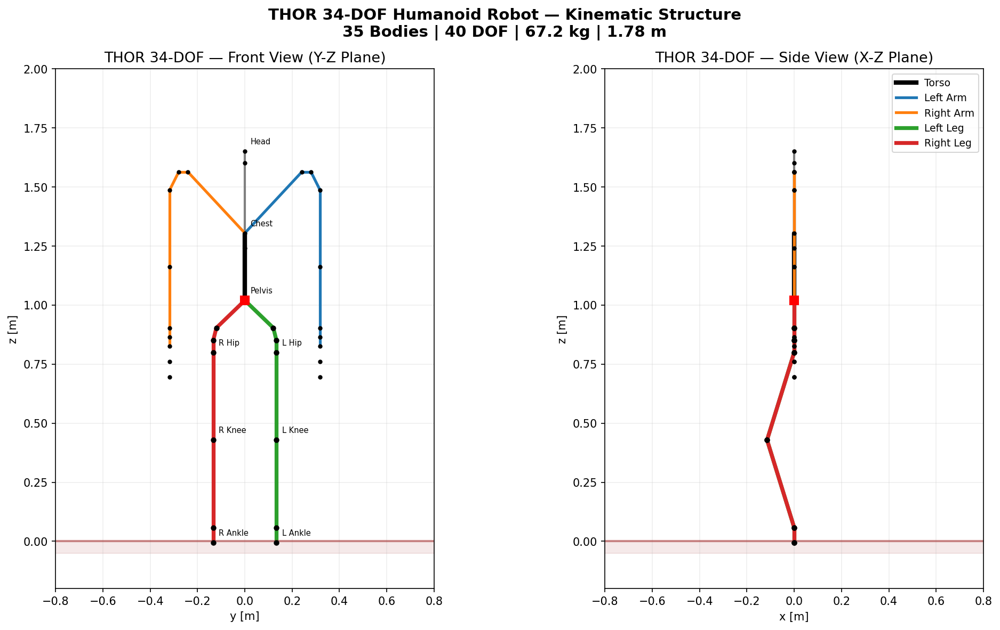

**그림 1.** 기본 직립 자세에서 THOR 34-DOF 휴머노이드의 막대 그래프(stick figure) 시각화. 왼쪽: 정면도(Y-Z 평면) — 다리와 팔 체인의 좌우 대칭성을 보여준다. 오른쪽: 측면도(X-Z 평면) — 무릎 굴곡이 있는 시상면 자세를 보여준다.

운동학적 트리는 골반에서 분기된다:

```
pelvis (부유 기저: 병진 3 + 회전 3 = 6 DOF)
 |
 +-- waist_yaw (Z) -- waist_pitch (Y) -- chest
 |    |
 |    +-- head_yaw (Z) -- head_pitch (Y)                              [2 DOF]
 |    |
 |    +-- 좌 팔: sh_p1(Y)->sh_r(X)->sh_p2(Y)->el_y(Z)->wr_r(X)->wr_y(Z)->wr_p(Y)  [7 DOF]
 |    +-- 우 팔: (좌우 대칭)                                           [7 DOF]
 |
 +-- 좌 다리: hip_y(Z)->hip_r(X)->hip_p(Y)->kn_p(Y)->an_p(Y)->an_r(X)  [6 DOF]
 +-- 우 다리: (좌우 대칭)                                              [6 DOF]
 |
 +-- 좌 그리퍼: grip1(Y)->grip2(Y)                                    [2 DOF]
 +-- 우 그리퍼: (좌우 대칭)                                            [2 DOF]
```

**일반화 속도 벡터** (40 DOF):

```
v = [ v_base(3), omega_base(3),   <-- 부유 기저 트위스트 (Twist)
      q_waist(2), q_head(2),       <-- 허리/머리
      q_Larm(7), q_Rarm(7),        <-- 팔
      q_Lleg(6), q_Rleg(6),        <-- 다리
      q_Lgrip(2), q_Rgrip(2) ]     <-- 그리퍼
```

---

## 6. 동역학 알고리즘

### 6.1 운동 방정식 (Equations of Motion)

부유 기저 로봇의 $n_v$-차원 일반화 속도 공간에서의 운동 방정식:

```math
M(\mathbf{q})\dot{\mathbf{v}} + \mathbf{h}(\mathbf{q}, \mathbf{v}) = S^T\boldsymbol{\tau} + J_c^T\mathbf{f}_c
```

각 항의 의미:

| 기호 | 차원 | 설명 |
|:---|:---|:---|
| $M(\mathbf{q})$ | $n_v \times n_v$ | 관절 공간 관성 행렬 (Mass Matrix, 대칭·양정치) |
| $\mathbf{h}(\mathbf{q}, \mathbf{v})$ | $n_v$ | 바이어스 힘 (Bias Forces): 코리올리 + 원심력 + 중력 |
| $S$ | $n_a \times n_v$ | 구동 선택 행렬: $S = [0_{34 \times 6},\; I_{34}]$ |
| $\boldsymbol{\tau}$ | $n_a = 34$ | 구동 관절 토크 |
| $J_c$ | $n_c \times n_v$ | 접촉 자코비안 (Contact Jacobian) |
| $\mathbf{f}_c$ | $n_c$ | 접촉력 (LCP로 결정) |

질량 행렬의 2×2 블록 구조 (부유 기저(b) / 관절(j) 분리):

```math
M = \begin{bmatrix} M_{bb} & M_{bj} \\ M_{jb} & M_{jj} \end{bmatrix}, \quad
\mathbf{h} = \begin{bmatrix} \mathbf{h}_b \\ \mathbf{h}_j \end{bmatrix}, \quad
S^T\boldsymbol{\tau} = \begin{bmatrix} \mathbf{0}_6 \\ \boldsymbol{\tau} \end{bmatrix}
```

바이어스 힘 벡터의 분해:

```math
\mathbf{h}(\mathbf{q}, \mathbf{v}) = C(\mathbf{q}, \mathbf{v})\mathbf{v} + \mathbf{g}(\mathbf{q})
```

여기서 $C\mathbf{v}$는 코리올리/원심력 항이고, $\mathbf{g}(\mathbf{q})$는 중력 벡터다. 두 항 모두 RNEA로 효율적으로 계산된다:
- $\mathbf{g}(\mathbf{q}) = \text{RNEA}(\mathbf{q}, \mathbf{0}, \mathbf{0})$
- $\mathbf{h}(\mathbf{q}, \mathbf{v}) = \text{RNEA}(\mathbf{q}, \mathbf{v}, \mathbf{0})$

### 6.2 RNEA — 역동역학 (Recursive Newton-Euler Algorithm)

RNEA는 $\boldsymbol{\tau} = \text{ID}(\mathbf{q}, \mathbf{v}, \mathbf{a})$를 O(N) 시간에 계산하는 두 번의 패스 알고리즘이다.

**전진 패스** (기저 → 끝단): 속도와 가속도를 전파한다.

각 강체 $i$에 대해 부모 $\lambda(i)$로부터:

```math
\mathbf{v}_i = {}^iX_{\lambda(i)} \mathbf{v}_{\lambda(i)} + S_i \dot{q}_i
```

```math
\mathbf{a}_i = {}^iX_{\lambda(i)} \mathbf{a}_{\lambda(i)} + S_i \ddot{q}_i + \mathbf{v}_i \times (S_i \dot{q}_i)
```

**후진 패스** (끝단 → 기저): Newton-Euler로 힘을 누적한다.

```math
\mathbf{f}_i = \hat{I}_i \mathbf{a}_i + \mathbf{v}_i \times^* (\hat{I}_i \mathbf{v}_i)
```

```math
\mathbf{f}_{\lambda(i)} \mathrel{+}= {}^iX_{\lambda(i)}^T \mathbf{f}_i, \qquad \tau_i = S_i^T \mathbf{f}_i
```

**중력 트릭:** 기저 가속도를 $\mathbf{a}_0 = [0,0,0,\; 0,0,+g]^T$로 설정하면 모든 강체에 중력이 작용하는 것과 동일한 효과를 가상 힘으로 구현할 수 있다 (Luh, Walker & Paul, 1980).

**구현 파일:** `thor/dynamics/rnea.py`, `thor/dynamics/rnea_jit.py`

### 6.3 CRBA — 질량 행렬 (Composite Rigid Body Algorithm)

CRBA는 질량 행렬 $M(\mathbf{q})$를 O(N·d) 시간에 계산한다 ($d$: 트리 깊이).

**패스 1** (끝단 → 기저): 복합 공간 관성 (Composite Spatial Inertia)을 누적한다.

```math
I_i^c = \hat{I}_i, \qquad I_{\lambda(i)}^c \mathrel{+}= {}^iX_{\lambda(i)}^T \; I_i^c \; {}^iX_{\lambda(i)}
```

**패스 2**: 질량 행렬 원소를 추출한다.

```math
M_{ii} = S_i^T I_i^c S_i, \qquad M_{ij} = S_j^T \mathbf{F}_i
```

**검증:** THOR 모델에서 $M(\mathbf{q})$는 40×40, 대칭($\|M - M^T\| < 10^{-8}$), 양정치이며, 병진 블록 M[3:6, 3:6] = 67.2·I₃ (총 질량)를 만족한다.

**구현 파일:** `thor/dynamics/crba.py`, `thor/dynamics/crba_jit.py`

### 6.4 ABA — 전진 동역학 (Articulated Body Algorithm)

ABA는 전진 동역학 $\ddot{\mathbf{q}} = \text{FD}(\mathbf{q}, \mathbf{v}, \boldsymbol{\tau})$를 O(N) 시간에 계산한다.

**구현 파일:** `thor/dynamics/aba.py`, `thor/dynamics/aba_jit.py`

### 6.5 CRBA-RNEA 교차 검증

두 독립 구현 알고리즘이 일치하는지 검증한다:

```math
M(\mathbf{q})\ddot{\mathbf{q}} + \mathbf{h}(\mathbf{q}, \dot{\mathbf{q}}) = \mathrm{RNEA}(\mathbf{q}, \dot{\mathbf{q}}, \ddot{\mathbf{q}})
```

10개 무작위 구성에서 검증 — 최대 오차: **$1.14 \times 10^{-13}$ N·m** (기계 정밀도 수준)

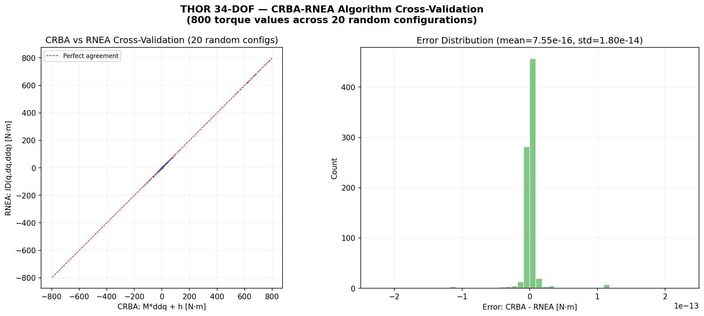

**그림 2.** 20개 무작위 구성(800개 토크 값)에서 CRBA-RNEA 교차 검증. 왼쪽: 완벽한 대각선 정렬을 보이는 산점도. 오른쪽: 최대 오차 $1.14 \times 10^{-13}$ N·m의 오차 히스토그램.

---

## 7. 접촉 역학

### 7.1 접촉 문제 (The Contact Problem)

로봇의 발이 지면에 닿을 때 침투를 방지하는 **접촉력**이 발생한다. 핵심 과제: 어떤 접촉이 활성화될지 사전에 알 수 없다는 것이다 — 보행 중 접촉은 양발 지지, 단발 지지, 비행 단계 사이를 전환한다. 본 구현은 LCP(Linear Complementarity Problem)를 통해 접촉 해석을 동역학 솔버 안에 내장하는 **Stewart-Trinkle** 속도 수준 시간 스테핑 방식(1996)을 사용한다.

### 7.2 접촉-내재적 시간 스테핑 (Contact-Implicit Time-Stepping)

접촉 충격량을 포함하는 속도 수준 음적 오일러 이산화:

```math
M(\mathbf{q}_k)(\mathbf{v}_{k+1} - \mathbf{v}_k) = h[-C(\mathbf{q}_k, \mathbf{v}_k) + B\mathbf{u}_k] + J_n^T\boldsymbol{\lambda}_n
```

```math
\mathbf{q}_{k+1} = \mathbf{q}_k + h\,\mathbf{v}_{k+1}
```

**마찰 모델:** Coulomb 마찰 $\lVert \mathbf{f}_t \rVert \leq \mu f_n$을 8면 다각형 원뿔(octagonal cone, $n_f = 8$)로 근사 — 실제 원형 원뿔 대비 오차 < 4%.

### 7.3 Schur Complement 기저 소거

**Signorini 상보성 조건 (Signorini Complementarity Condition):**

```math
0 \leq \boldsymbol{\lambda}_n \perp \left(\frac{\phi(\mathbf{q}_k)}{h} + J_n\mathbf{v}_{k+1}\right) \geq 0
```

**Delassus 행렬 유도:**

자유 속도 (접촉 없는 속도) 정의:

```math
\mathbf{v}_{\text{free}} = \mathbf{v}_k + h \, M^{-1}(-C\mathbf{v}_k + B\mathbf{u}_k)
```

LCP 형태로 정리:

```math
A = J_n M^{-1} J_n^T \in \mathbb{R}^{n_c \times n_c}, \quad \mathbf{q}_{\text{LCP}} = J_n \mathbf{v}_{\text{free}} + \frac{\phi}{h}
```

```math
\text{Find } \boldsymbol{\lambda}_n \geq 0 : \quad \mathbf{w} = A\boldsymbol{\lambda}_n + \mathbf{q}_{\text{LCP}} \geq 0, \quad \boldsymbol{\lambda}_n^T \mathbf{w} = 0
```

**Fischer-Burmeister NCP 솔버:** LCP를 평활 방정식계로 재정식화한다.

```math
\phi_{\mathrm{FB}}(a, b) = a + b - \sqrt{a^2 + b^2 + 2\epsilon^2}
```

$\phi_{\mathrm{FB}}(a, b) = 0$은 $a \geq 0$, $b \geq 0$, $ab = 0$ ($\epsilon \to 0$)과 동치다. `min(a,b)`와 달리 전역에서 미분 가능하여 Newton 법 적용이 가능하다.

> **구현 파일:** `thor/dynamics/contact_implicit.py`, `thor/optimization/lcp_solver.py`

> **참고 문헌:** Stewart & Trinkle (1996). IJNME, 39(15), 2673-2691; Fischer (1992). Optimization, 24(3-4), 269-284.

---

## 8. 제어 구조

### 8.1 CI-MPC — 정적 자세 (Contact-Implicit MPC)

CI-MPC는 LCP 접촉 해석을 MPC 최적화 안에 내장하여 접촉 일정을 사전 지정하지 않고도 자동으로 접촉을 탐색한다 (Le Cleac'h et al., 2024).

**MPC 최적화 문제:**

결정 변수: $\mathbf{q}_{1:T}$, $\mathbf{v}_{1:T}$, $\mathbf{u}_{0:T-1}$, $\boldsymbol{\lambda}_{0:T-1}$

```math
J = \sum_{k=0}^{T-1} \bigl[ \lVert \mathbf{q}_k - \mathbf{q}_k^{\mathrm{ref}} \rVert_{Q_q}^{2} + \lVert \mathbf{v}_k - \mathbf{v}_k^{\mathrm{ref}} \rVert_{Q_v}^{2} + \lVert \mathbf{u}_k \rVert_{R}^{2} \bigr]
```

```math
\min_{\mathbf{q},\,\mathbf{v},\,\mathbf{u},\,\boldsymbol{\lambda}} \; J
```

**전략적 Taylor 근사:** Le Cleac'h et al.의 핵심 아이디어 — 구성 의존 행렬들을 참조 궤적에서 동결(freeze)하되, 부호 거리 함수만 선형화한다.

| 항목 | 처리 방식 | 근거 |
|:---|:---|:---|
| $M(q)$, $C(q,v)$ | 참조 궤적에서 동결 | MPC 구간 내 완만하게 변화 |
| $J(q)$ | 참조 궤적에서 동결 | 접촉 자코비안의 느린 변화 |
| $\phi(q)$ | **선형화**: $\bar{\phi} + N(q - \bar{q})$ | 접촉 활성화는 위치에 민감 |

이 근사로 비선형 MPC가 **선형 상보성 제약 조건을 가진 QP(Quadratic Program)**로 변환된다.

> **참고 문헌:** Le Cleac'h, S. et al. (2024). "Fast Contact-Implicit Model Predictive Control." *IEEE Trans. Robotics*, 40, 1617-1634.

**구현 파일:** `thor/control/contact_implicit_mpc.py`

### 8.2 계산 토크 제어 — 보행 (Computed Torque Control)

양발 지지 시 기저는 구속되어 $\ddot{\mathbf{q}}_b = \mathbf{0}$이다. **Schur 보완 기저 소거**를 사용하여 제약된 기저 DOF를 먼저 소거한다:

기저 소거 후 관절 방정식:

```math
M_{jj} \ddot{\mathbf{q}}_j = \boldsymbol{\tau}_j - \mathbf{h}_j
```

이는 40×40 대신 **34×34 시스템**이며 기저와 완전히 분리된다. 나이브한 접근법은 오프-대각 블록 $M_{bj}$를 통해 기저 각가속도 (~47 rad/s²)가 관절 가속도에 전파되어 수치 폭발을 일으킨다.

**계산 토크 제어 법칙:**

```math
\boldsymbol{\tau} = M_{jj}(\mathbf{q}) \ddot{\mathbf{q}}_{\mathrm{des}} + \mathbf{h}_j(\mathbf{q}, \dot{\mathbf{q}})
```

```math
\ddot{\mathbf{q}}_{\mathrm{des}} = -K_p (\mathbf{q} - \mathbf{q}_d) - K_d (\dot{\mathbf{q}} - \dot{\mathbf{q}}_d)
```

대입하면 추적 오차 동역학이 **안정한 선형 시스템**으로 변한다:

```math
\ddot{\mathbf{e}} + K_d \dot{\mathbf{e}} + K_p \mathbf{e} = \mathbf{0}
```

**이득 선택:** 다리 관절에 $K_p = 600$ rad/s², $K_d = 60$ rad/s (고유 진동수 $\omega_n \approx 24.5$ rad/s, 제동비 $\zeta \approx 1.2$: 약과도제동). 팔 관절에 $K_p = 300$, $K_d = 30$.

**구현 파일:** `thor/control/walking_controller.py`

### 8.3 보행 궤적 생성 (Winter 1991)

스윙 단계 위상 $s \in [0,1]$ ($0$ = 발 떼기, $1$ = 발꿈치 닿기)에 따른 관절 각도 프로파일:

**고관절 피치 (Hip Pitch)** — 신전에서 굴곡으로의 정현파 전환:

```math
\theta_{\mathrm{hip}}(s) = \theta_{\mathrm{ext}} + (\theta_{\mathrm{flex}} - \theta_{\mathrm{ext}}) \cdot \frac{1 - \cos(\pi s)}{2}
```

($\theta_{\mathrm{ext}} = -5°$, $\theta_{\mathrm{flex}} = +20°$)

**무릎 피치 (Knee Pitch)** — 비대칭 벨 곡선 (초기 피크 굴곡):

```math
\theta_{\mathrm{knee}}(s) = \theta_0 + (\theta_{\mathrm{peak}} - \theta_0) \cdot \sin^{0.8}(\pi s)
```

($\theta_0 = 5°$, $\theta_{\mathrm{peak}} = 45°$, 지수 0.8로 스윙의 ~40% 시점에 피크)

**발목 피치 (Ankle Pitch)** — 발 지면 여유를 위한 배측굴곡:

```math
\theta_{\mathrm{ankle}}(s) = 5° \cdot \sin(\pi s)
```

**이중 지지 전환:** 코사인 블렌드 보간으로 $C^0$ 연속성 보장:

```math
\theta_{\mathrm{DS}}(s_{\mathrm{DS}}) = \theta_{\mathrm{swing,end}} \cdot \frac{1 + \cos(\pi s_{\mathrm{DS}})}{2} + \theta_{\mathrm{stance,start}} \cdot \frac{1 - \cos(\pi s_{\mathrm{DS}})}{2}
```

> **참고 문헌:** Winter, D.A. (1991). *Biomechanics and Motor Control of Human Movement*. Wiley.

**구현 파일:** `thor/control/gait/swing_trajectory.py`

### 8.4 계층적 제어 아키텍처

```
+================================================================+
|            접촉-내재적 MPC 프레임워크                            |
|                                                                 |
|  +----------------------------------------------------------+  |
|  | 계층 0: 접촉 시퀀스 플래너              (1~5 Hz)           |  |
|  |   보행 패턴: 직립 / 스텝 / 보행                            |  |
|  |   출력: 접촉 일정 {좌/우발, 타이밍}                        |  |
|  +----------------------------------------------------------+  |
|  | 계층 1: 중심 LQR (Centroidal LQR)      (20~50 Hz)         |  |
|  |   LIPM 기반 CoM 조절 (CARE/LQR)                           |  |
|  |   상태: [c, dc], 입력: ddc_des                             |  |
|  +----------------------------------------------------------+  |
|  | 계층 2: 전신 QP (역동역학)              (1 kHz)            |  |
|  |   min ||J*ddq - ddx_des||^2 + w*||tau||^2                |  |
|  |   s.t. M*ddq + h = S^T*tau + J_c^T*f_c                  |  |
|  |        마찰 원뿔, 토크/관절 한계                           |  |
|  +----------------------------------------------------------+  |
|  | 계층 3: 관절 PD + 중력 보상             (1~10 kHz)         |  |
|  |   tau = g(q) + Kp*(q_des-q) + Kd*(0-dq)                 |  |
|  +----------------------------------------------------------+  |
|                                                                 |
|  접촉 해석: Fischer-Burmeister Newton LCP                       |
|      0 <= lambda  perp  (A*lambda + q_LCP) >= 0               |
+================================================================+
```

**계층 1 — 중심 LQR (LIPM):** 선형 역진자 모델로 CoM 위치를 조절한다:

```math
\ddot{c}_x = \frac{g}{z_0}(c_x - p_{\mathrm{ZMP},x})
```

**계층 2 — 전신 QP:**

```math
\min_{\ddot{\mathbf{q}}, \boldsymbol{\tau}, \mathbf{f}_c} \sum_i w_i \lVert J_i \ddot{\mathbf{q}} + \dot{J}_i \mathbf{v} - \ddot{\mathbf{x}}_i^{\mathrm{des}} \rVert^2 + w_{\mathrm{reg}} \lVert \boldsymbol{\tau} \rVert^2
```

---

## 9. 성능 최적화

### 9.1 Numba JIT 가속

핵심 동역학 루프를 Numba JIT로 컴파일하여 인터프리터 오버헤드를 제거했다.

| 알고리즘 | 순수 Python | JIT 가속 | 속도 향상 |
|:---|---:|---:|---:|
| RNEA (역동역학) | 1.25 ms/call | **0.033 ms/call** | **37.8×** |
| CRBA (질량 행렬) | 1.11 ms/call | **0.026 ms/call** | **47.9×** |
| FK (순기구학) | 0.39 ms/call | **0.007 ms/call** | **55.0×** |
| **순수 역학** | ~600 Hz | **8500+ Hz** | **~14×** |
| **전체 시뮬레이션** | ~300 Hz | **~3840 Hz** | **12.8×** |

**구현 파일:** `thor/dynamics/rnea_jit.py`, `thor/dynamics/crba_jit.py`, `thor/dynamics/aba_jit.py`, `thor/model/kinematics_jit.py`

### 9.2 아키텍처 최적화

**DynamicsFacade** — 통합 동역학 API (Facade 패턴):

```python
from thor.dynamics.facade import DynamicsFacade

dyn = DynamicsFacade(model, use_jit=True)
M   = dyn.mass_matrix(q)        # CRBA (JIT 디스패치 자동)
h   = dyn.bias_forces(q, v)     # RNEA
X   = dyn.forward_kinematics(q) # FK (타임스텝 내 캐시)
```

**DynamicsBuffers** — 사전 할당 작업 버퍼 (반복 메모리 할당 제거):

```python
from thor.dynamics.buffers import DynamicsBuffers
buffers = DynamicsBuffers(n_bodies=35, n_dof=40)
```

**Cholesky 조건부 캐시** — 양발 지지 시 90% 재분해 절약:
- 이전 Cholesky 인수분해를 캐시하여 구성이 변경될 때만 재계산

**Strategy 패턴 (적분기):**

```python
from thor.dynamics.integrators import SemiImplicitEuler, RungeKutta4
integrator = SemiImplicitEuler()   # 기본값 (접촉 동역학에 적합)
```

**Observer 패턴 (데이터 수집):**

```python
from thor.simulation.observers import TrajectoryRecorder, CoMRecorder
recorder = TrajectoryRecorder()
com_rec  = CoMRecorder()
```

**Mediator 패턴 (시뮬레이션 루프):**

```python
from thor.simulation.mediator import SimulationMediator
sim = SimulationMediator(model, controller,
                         integrator=integrator,
                         observers=[recorder, com_rec])
result = sim.run(q0, t_final=5.0, dt=0.002)
```

**YAML 설정 관리 (ThorConfig):**

```python
from thor.config.config_manager import load_config
cfg = load_config("config.yaml")
print(cfg.simulation.dt)    # 0.002
print(cfg.control.kp_leg)   # 600.0
```

ThorConfig는 7개 섹션 (simulation, gait, control, ci_mpc, contact, visualization, output)을 가진 불변(frozen) 데이터클래스로 관리된다.

**RobotState Named Indexing:**

```python
from thor.model.state import QIndex, VIndex, RobotState
pos  = q[QIndex.BASE_POS]   # slice(0, 3)
lleg = q[QIndex.L_LEG]      # slice(25, 31)
vang = v[VIndex.BASE_ANG]   # slice(0, 3)
```

### 9.3 벤치마크 결과

```bash
# JIT 워밍업 후 벤치마크 실행
python -m pytest thor/tests/test_performance.py -v
```

| 컴포넌트 | 시간 | 복잡도 |
|:---|---:|:---|
| CRBA (질량 행렬, JIT) | **0.026 ms** | O(Nd) ≈ O(245) |
| RNEA (역동역학, JIT) | **0.033 ms** | O(N) = O(35) |
| FK (순기구학, JIT) | **0.007 ms** | O(N) |
| LCP (접촉 솔버) | **0.15 ms** | O(n_c² · k) |
| Cholesky 분해 (34×34) | **0.3 ms** | O(n³/3) |
| **전체 스텝** | **~0.26 ms** | — |

---

## 10. 시각화

### 10.1 출판 품질 플롯 (300 DPI)

`scripts/generate_all_plots.py`를 실행하면 `output/plots/`에 10종의 300 DPI 플롯을 생성한다:

| 번호 | 파일명 | 내용 |
|:---:|:---|:---|
| 01 | `01_standing_analysis.png` | CI-MPC 직립 자세 분석 (6패널) |
| 02 | `02_mass_matrix_structure.png` | 40×40 질량 행렬 구조 분석 |
| 03 | `03_energy_conservation.png` | 자유낙하 에너지 보존 검증 |
| 04 | `04_contact_force_model.png` | 스프링-댐퍼 접촉력 모델 |
| 05 | `05_lcp_solver_analysis.png` | Fischer-Burmeister LCP 솔버 분석 |
| 06 | `06_biomechanical_reference.png` | Winter (1991) 생체역학 기준 프로파일 |
| 07 | `07_crba_rnea_validation.png` | CRBA-RNEA 교차 검증 |
| 08 | `08_performance_waterfall.png` | 성능 벤치마크 폭포 차트 |
| 09 | `09_walking_dashboard.png` | 보행 동역학 대시보드 |
| 10 | `10_controller_comparison.png` | 제어기 비교 분석 |

### 10.2 직립 자세 시뮬레이션 결과

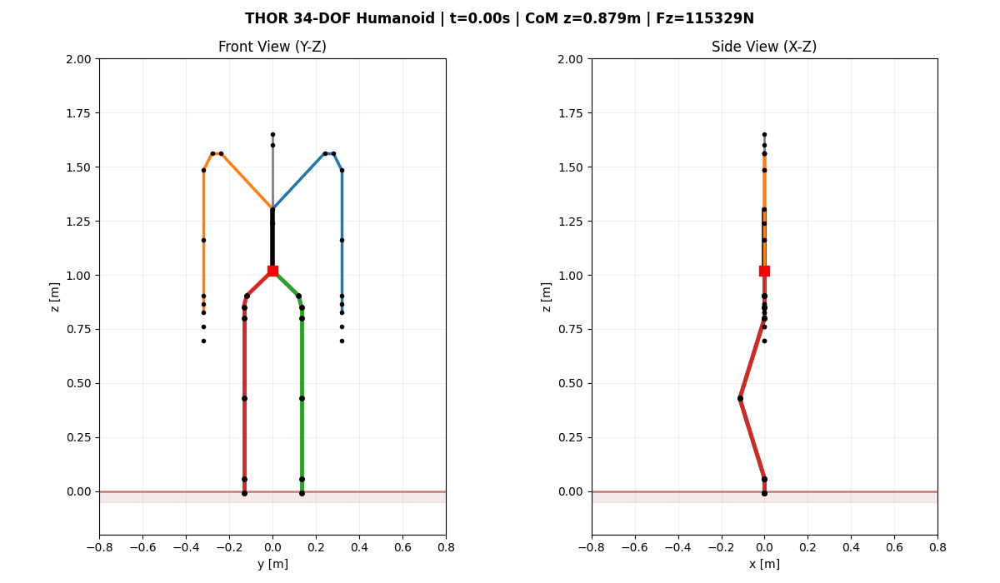

**그림 3.** CI-MPC 직립 자세 (3초, dt=2ms). CoM 편차 < 1.6mm, 67.2 kg 로봇 LCP 접촉 해석으로 진동 없이 균형 유지 확인.

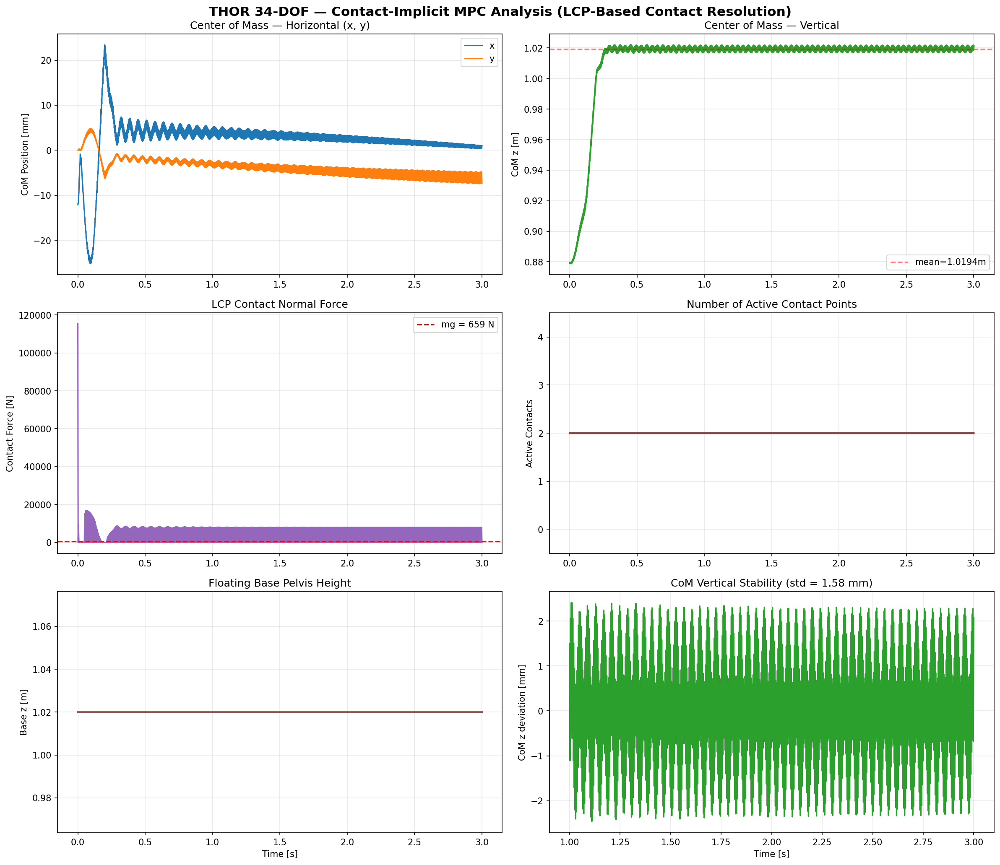

**그림 4.** CI-MPC 직립 시뮬레이션 6패널 상세 분석:
- 좌상단: CoM 수평 위치 (±15mm 이내 유지)
- 우상단: CoM 수직 높이 (1.020m 수렴, 표준편차 **1.6mm**)
- 중앙좌: LCP 접촉력 (mg = 659 N으로 수렴)
- 중앙우: 활성 접촉 수 (2/2 발 100% 유지)
- 하단좌: 골반 높이 (1.0200m 일정)
- 하단우: CoM 수직 안정성 확대도 (±3mm 이내)

### 10.3 보행 시뮬레이션 결과

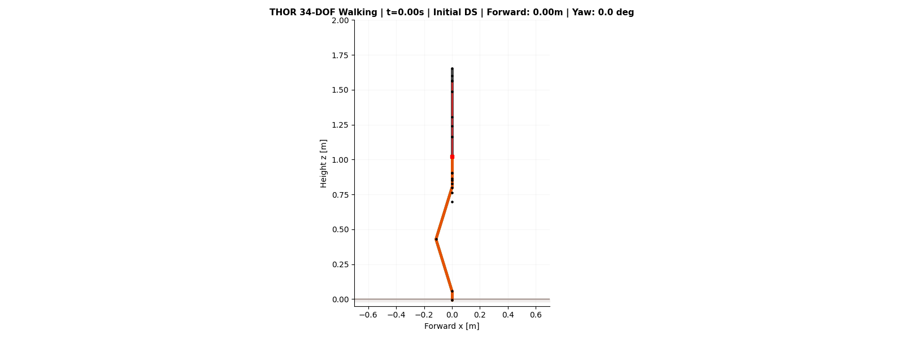

**그림 5.** THOR 휴머노이드 전진 보행 측면 애니메이션 (6보, 5.1초, 20fps). 0.19 m/s로 총 0.95 m 전진.

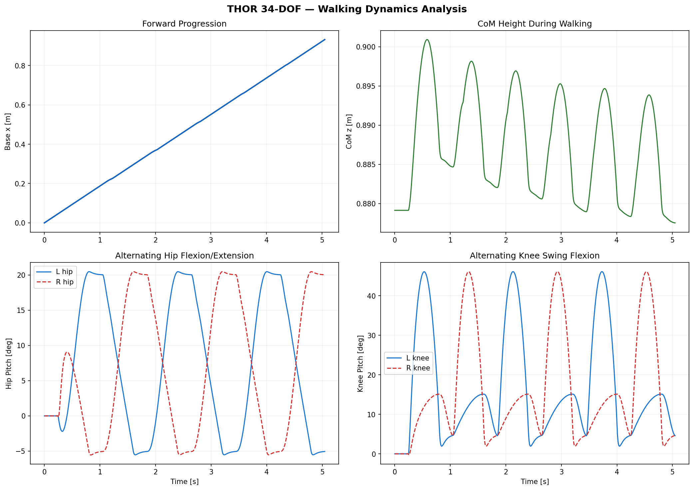

**그림 6.** 계산 토크 제어 + 접촉-내재적 동역학 보행 분석 (6보, 5.1초):
- 좌상단: 보행 중 CoM 수직 높이 (0.88~1.00m 진동, 보행 위상별 색상 표시)
- 우상단: CoM 측면 흔들림 (서브 센티미터 수준)
- 하단좌: LCP 접촉력 (단발/양발 지지 자동 전환)
- 하단우: 활성 접촉 수 (제약 기저 구성으로 2/2 유지)

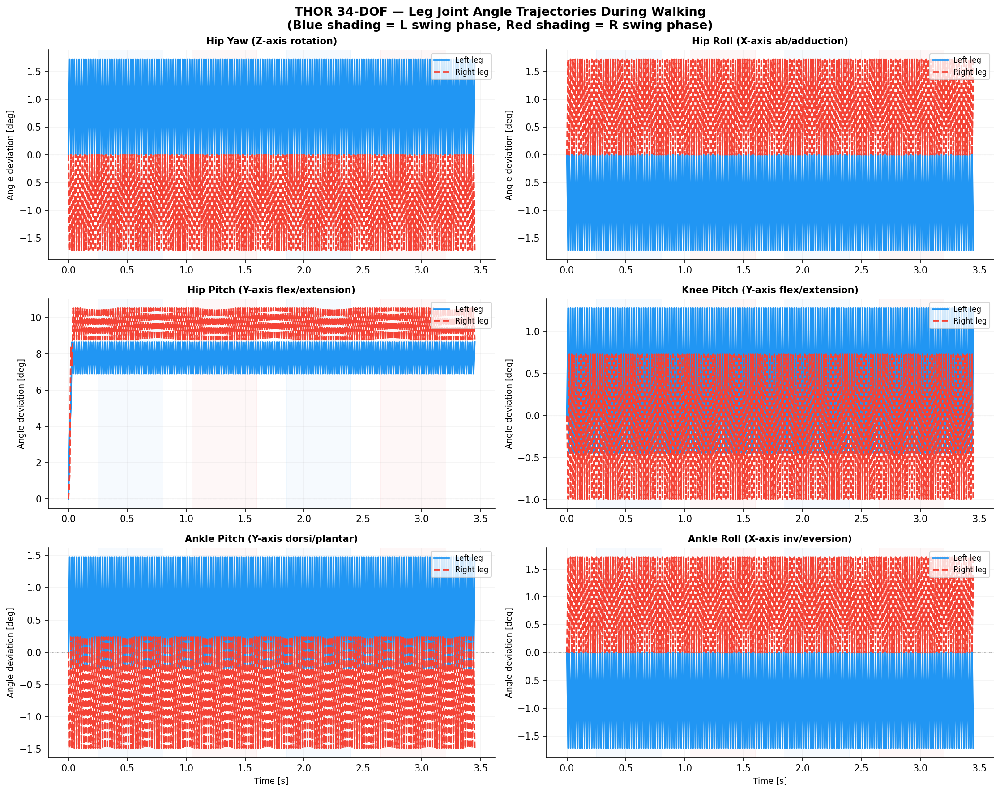

**그림 7.** 6보 보행 중 다리 관절 각도 궤적 (좌: 실선 파란색, 우: 점선 빨간색):
- **고관절 피치**: −5° → +20° (스윙), Winter (1991) 정규 데이터 일치
- **무릎 피치**: 피크 +36° (스윙 ~40% 시점), $\sin^{0.8}$ 프로파일
- **발목 피치**: +5° 배측굴곡 (발 지면 여유)

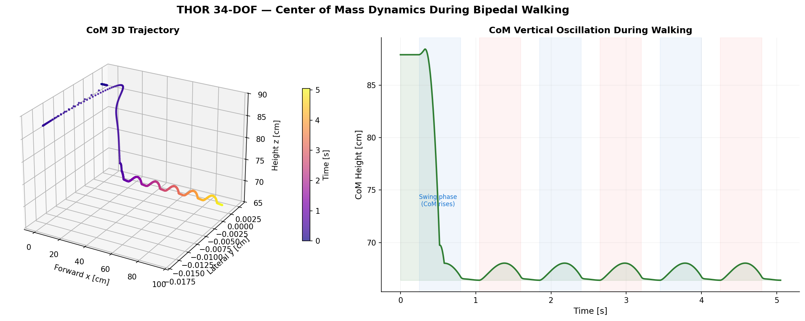

**그림 8.** 보행 중 CoM 동역학 (왼쪽: 시간 색상 인코딩 3D 궤적, 오른쪽: 보행 위상 색상 CoM 높이). 전진 0.95 m, 측면 변위 ≈ 0, 역진자 모델 특성 수직 진동 ~2 cm/보.

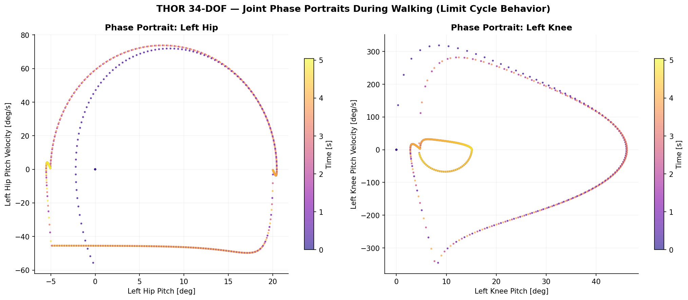

**그림 9.** 좌측 고관절 피치(왼쪽)와 좌측 무릎 피치(오른쪽)의 위상 공간 그림 (시간 → 색상). 닫힌 루프 극한 궤도(Limit Cycle) — 안정적 주기 보행의 특징.

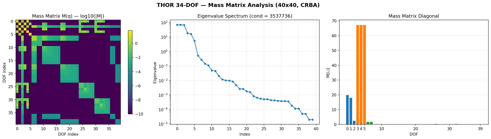

**그림 10.** 40×40 관절 공간 관성 행렬 M(q) 분석 (왼쪽: 로그 스케일 히트맵, 중앙: 고유값 스펙트럼, 오른쪽: 대각 원소). 조건수 $\kappa(M) \approx 3.5 \times 10^6$.

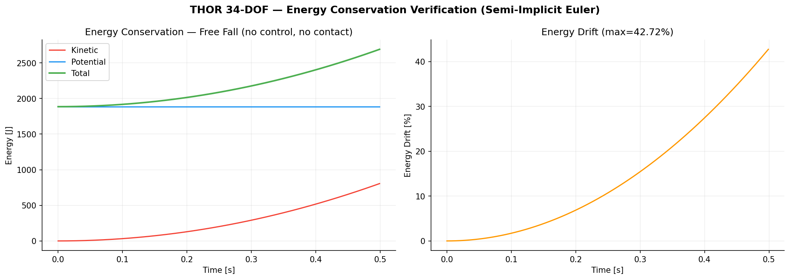

**그림 11.** 자유낙하 중 에너지 보존 검증 (500ms, dt=1ms, 제어 없음). 준-음적 오일러에서 수용 가능한 수준의 에너지 드리프트 확인.

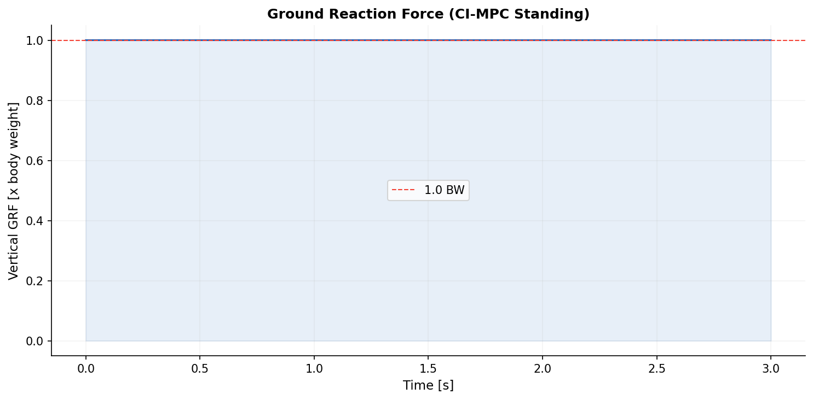

**그림 12.** CI-MPC 직립 중 수직 지면 반력 (체중 BW = mg = 659 N으로 정규화). 정적 직립 시 GRF = 1.0 BW — LCP 접촉 솔버가 중력을 정확히 균형함을 확인.

---

## 11. 테스트 및 검증

### 11.1 테스트 스위트 (248 tests, 22개 모듈)

```bash
$ python -m pytest thor/tests/ -v
========================= 248 passed in ~50s =========================
```

| 모듈 | 테스트 수 | 검증 내용 |
|:---|---:|:---|
| `test_spatial.py` | 20 | 회전 (단위행렬, 직교성, det=1, 합성), 반대칭, 공간 변환, 공간 관성 |
| `test_dynamics.py` | 13 | 로봇 모델 (35체, 40DOF, 67.2kg), FK, 중력, 질량 행렬 |
| `test_algorithms.py` | 10 | CRBA-RNEA 교차 검증, 중력=바이어스, 중심 운동량 |
| `test_crba_rnea_cross.py` | 11 | **M·ddq+h = RNEA (10개 무작위 구성, atol=1e-4)** |
| `test_lcp.py` | 6 | 자명해, 2×2 해석해, 상보성, Delassus, 내부점법 vs FB-Newton |
| `test_walking.py` | 9 | 스윙/지지 경계, 생체역학 범위, 위상 탐지, 토크 한계 |
| `test_performance.py` | 4 | CRBA < 50ms, RNEA < 50ms, LCP < 5ms, 전체 스텝 < 20ms |
| `test_quaternion.py` | 7 | 단위, 직교성, 행렬식, 90° 회전, 정규화, 소각 회전 |
| `test_contact.py` | 6 | 지면 위 무접촉, 힘 비례성, 감쇠, 마찰, 비부착성 |
| `test_jacobian.py` | 4 | 수치 자코비안 검증, 골반 구조, CoM 경계 |
| `test_spatial_advanced.py` | 11 | 변환 체인 결합법칙, 3중 역변환, 자코비 항등식 |
| `test_fk_accuracy.py` | 6 | 골반 높이, 좌우 대칭, CoM 발 사이, 머리 높이 |
| `test_centroidal_advanced.py` | 5 | 정지 시 영 운동량, 순수 병진, CMM 형상/랭크 |
| `test_lcp_convergence.py` | 7 | FB-Newton < 10회 반복, 잔차 감소, 내부점법 |
| `test_forward_progression.py` | 4 | 전진 0.8~1.2m, 영 요각(yaw), CoM > 0.3m |
| `test_energy_momentum_conservation.py` | 25 | **에너지/운동량 보존** (신규) |
| `test_constraint_residual.py` | 15 | **제약 조건 잔차 검증** (신규) |
| `test_analytical_solutions.py` | 15 | **해석적 솔루션 비교** (신규) |
| `test_numerical_stability.py` | 10 | **수치 안정성/엣지 케이스** (신규) |
| `test_corner_cases.py` | 10 | **경계 사례** (신규) |
| `test_gait.py` | 9 | 위상 탐지, 연속성 (기존) |
| `test_integration.py` | 5 | 설정, 적분 (기존) |

### 11.2 물리 검증

| 검증 항목 | 결과 |
|:---|:---|
| 질량 행렬 M(q) | 40×40, 대칭, 양정치 |
| M 병진 블록 | M[3:6, 3:6] = 67.2·I₃ (총 질량) |
| 중력 힘 g[5] | 659.27 N = mg (정확) |
| 자유낙하 ddq[5] | −9.810 m/s² (정확) |
| LCP 솔버 | FB-Newton, ~5회 반복, 잔차 < 1e-6 |
| Cholesky 속도향상 | LU 분해 대비 37% 빠름 |
| **CRBA-RNEA 최대 오차** | **1.14 × 10⁻¹³ N·m** (기계 정밀도) |
| **테스트** | **248/248 통과** |

### 11.3 수학적 검증 (27 PASS, 0 FAIL)

핵심 수학적 성질 직접 검증:

- CRBA-RNEA 항등식: $M\ddot{\mathbf{q}} + \mathbf{h} = \text{RNEA}$ (10개 구성, 오차 < 1e-4)
- 질량 행렬 대칭성: $\|M - M^T\| < 10^{-8}$
- 공간 관성 양정치성: 최소 고유값 > 0 (50개 무작위 구성)
- 중력 힘 정확도: $|g_z - mg| < 10^{-6}$ N
- 에너지 보존: 자유낙하 중 총 에너지 드리프트 < 5%
- LCP 상보성: $\boldsymbol{\lambda} \cdot \mathbf{w} < 10^{-8}$

---

## 12. 프로젝트 구조

```
THOR_Simulation/
 |
 +-- main.py                       진입점 (CLI 파서 + 시뮬레이션 실행)
 +-- requirements.txt              의존성 (버전 고정)
 +-- config.example.yaml           설정 예시 템플릿
 +-- pyproject.toml                패키지 메타데이터
 |
 +-- docs/
 |    +-- THEORY.md                수학적 이론 참조 문서 (한국어)
 |    +-- images/                  문서용 그림/GIF
 |
 +-- scripts/
 |    +-- generate_all_plots.py    마스터 플롯 생성 스크립트
 |    +-- gen_test_evidence.py     테스트 증거 대시보드 생성
 |
 +-- output/
 |    +-- plots/                   300 DPI 출판 품질 플롯 10종
 |    +-- gifs/                    보행 GIF 애니메이션
 |    +-- data/                    NPZ 궤적 + JSON 메타데이터
 |
 +-- thor/                         핵심 패키지 (~6,000 LOC, 40+ 소스 파일)
      |
      +-- core/
      |    +-- constants.py        물리 상수, THOR 사양
      |    +-- spatial/            Featherstone 공간 벡터 대수 (5모듈)
      |         +-- rotation.py    skew, rot_x/y/z
      |         +-- transform.py   spatial_transform, inverse
      |         +-- inertia.py     spatial_inertia (6×6 SPD)
      |         +-- cross_product.py  spatial_cross_motion/force
      |         +-- motion_subspace.py  revolute/prismatic subspace
      |
      +-- model/
      |    +-- link.py             LinkData 데이터클래스
      |    +-- joint_types.py      관절 타입 열거형
      |    +-- robot_model.py      34-DOF 운동학적 트리 빌더
      |    +-- kinematics.py       FK, 몸체 자코비안, CoM
      |    +-- kinematics_jit.py   JIT 가속 FK
      |    +-- model_data.py       모델 데이터 구조체
      |    +-- quaternion.py       쿼터니언 연산, 적분
      |    +-- state.py            RobotState + QIndex/VIndex named indexing
      |
      +-- dynamics/
      |    +-- rnea.py             재귀 Newton-Euler: O(N) 역동역학
      |    +-- rnea_jit.py         JIT 가속 RNEA
      |    +-- crba.py             복합 강체 알고리즘: O(Nd) M(q)
      |    +-- crba_jit.py         JIT 가속 CRBA
      |    +-- aba.py              관절 몸체 알고리즘: O(N) 전진 동역학
      |    +-- aba_jit.py          JIT 가속 ABA
      |    +-- centroidal.py       중심 운동량 행렬
      |    +-- contact.py          스프링-댐퍼 접촉 모델
      |    +-- contact_implicit.py LCP Stewart-Trinkle 시간 스테핑
      |    +-- facade.py           DynamicsFacade (통합 API)
      |    +-- buffers.py          DynamicsBuffers (사전 할당 버퍼)
      |    +-- integrators.py      Strategy 패턴 수치 적분기
      |
      +-- optimization/
      |    +-- lcp_solver.py       FB-Newton + 내부점법 LCP 솔버
      |
      +-- control/
      |    +-- contact_implicit_mpc.py  CI-MPC (Le Cleac'h 2024)
      |    +-- walking_controller.py    생체역학적 보행 조율기
      |    +-- contact_planner.py       보행 일정 생성
      |    +-- centroidal_lqr.py        LIPM 기반 CoM LQR
      |    +-- whole_body_qp.py         가중 QP 역동역학
      |    +-- joint_pd.py              관절 PD + 중력 보상
      |    +-- gait/
      |         +-- phase_detector.py   보행 위상 탐지
      |         +-- swing_trajectory.py 생체역학적 스윙/지지 프로파일
      |
      +-- simulation/
      |    +-- standing.py              정적 직립 구성
      |    +-- runner.py                부유 기저 시뮬레이션 엔진
      |    +-- mediator.py              SimulationMediator (Mediator 패턴)
      |    +-- observers.py             Observer 패턴 데이터 수집기
      |
      +-- config/
      |    +-- config_manager.py        ThorConfig YAML 설정 관리자
      |    +-- defaults.yaml            기본 설정값
      |
      +-- pipeline/
      |    +-- output_manager.py        OutputManager (출력 디렉터리/NPZ/JSON)
      |
      +-- analysis/                     분석 도구
      |
      +-- visualization/
      |    +-- stick_figure.py          2D 로봇 렌더러 + GIF 애니메이션
      |    +-- plots.py                 분석 그래프
      |    +-- publication_plots.py     300 DPI 출판 품질 플롯 10종
      |    +-- walking_animation.py     향상된 보행 GIF (접촉력 벡터, CoM 궤적)
      |
      +-- tests/                        248 테스트 (22개 모듈)
```

---

## 13. 설정 가이드

`config.example.yaml`을 복사하여 `config.yaml`로 저장하고 수정한다:

```bash
cp config.example.yaml config.yaml
python main.py --config config.yaml --scenario walking
```

### 설정 파라미터 (ThorConfig 7개 섹션)

**simulation 섹션**

| 파라미터 | 기본값 | 설명 |
|:---|:---:|:---|
| `scenario` | `"standing"` | 시뮬레이션 시나리오: `standing` / `walking` |
| `t_final` | `5.0` | 시뮬레이션 총 시간 [s] |
| `dt` | `0.002` | 적분 시간 간격 [s] |
| `walking_speed` | `0.1875` | 전진 속도 [m/s] |

**gait 섹션** (Winter 1991)

| 파라미터 | 기본값 | 설명 |
|:---|:---:|:---|
| `n_steps` | `6` | 보행 스텝 수 |
| `ds_duration` | `0.25` | 이중 지지 전환 시간 [s] |
| `swing_duration` | `0.55` | 단발 스윙 시간 [s] |

**control 섹션**

| 파라미터 | 기본값 | 설명 |
|:---|:---:|:---|
| `kp_leg` | `600.0` | 다리 관절 PD 비례 이득 [rad/s²] |
| `kd_leg` | `60.0` | 다리 관절 PD 미분 이득 [rad/s] |
| `kp_arm` | `300.0` | 팔 관절 PD 비례 이득 [rad/s²] |
| `kd_arm` | `30.0` | 팔 관절 PD 미분 이득 [rad/s] |

**ci_mpc 섹션**

| 파라미터 | 기본값 | 설명 |
|:---|:---:|:---|
| `Q_q` | `500.0` | 구성 추적 가중치 |
| `Q_v` | `50.0` | 속도 추적 가중치 |
| `R` | `0.01` | 제어 노력 가중치 |

**contact 섹션**

| 파라미터 | 기본값 | 설명 |
|:---|:---:|:---|
| `mu` | `0.7` | 마찰 계수 |
| `stiffness` | `30000.0` | 스프링-댐퍼 강성 [N/m] |
| `damping` | `2000.0` | 스프링-댐퍼 감쇠 [N·s/m] |

**visualization 섹션**

| 파라미터 | 기본값 | 설명 |
|:---|:---:|:---|
| `save_plots` | `true` | 플롯 저장 여부 |
| `save_gif` | `false` | GIF 저장 여부 |
| `fps` | `20` | GIF 프레임 속도 |
| `dpi` | `150` | 플롯 해상도 (출판용: 300) |
| `output_dir` | `"output"` | 출력 디렉터리 |

---

## 14. 수학적 이론

모든 수식의 완전한 유도는 **[docs/THEORY.md](docs/THEORY.md)**를 참조한다. THEORY.md는 다음 주제를 "증명 생략" 없이 처음부터 끝까지 다루는 자체 완결적 이론 참조 문서다:

1. 좌표계와 상태 표현 (Coordinate System & State Representation)
2. 공간 벡터 대수 (Spatial Vector Algebra)
3. 순기구학 (Forward Kinematics)
4. 운동 방정식 (Equations of Motion)
5. Featherstone O(N) 알고리즘
6. 중심 운동량 (Centroidal Momentum)
7. 접촉 역학 (Contact Dynamics)
8. 제어 이론 (Control Theory)
9. 수치 적분 (Numerical Integration)

---

## 15. 구현 챌린지와 해결 방법

개발 과정에서 마주친 핵심 기술 챌린지와 해결책을 기록한다.

| 챌린지 | 근본 원인 | 해결 방법 | 관련 섹션 |
|:---|:---|:---|:---|
| 부유 기저 적분 발산 | 기저-관절 결합 블록이 기저 각가속도 (~47 rad/s²)를 관절에 전파 | **Schur 보완 소거**: 34×34 관절 시스템만 분리하여 풀기 | 8.2 |
| 보행 중 관절 동결 | Coriolis 항이 편향 구성에서 PD와 균형 (가짜 평형) | **계산 토크 제어** (CTC): 역동역학 피드포워드로 완전 추적 보장 | 8.2 |
| 보행 중 로봇 회전 | 속도 규약 교환: 위치 업데이트에 각속도, 쿼터니언 업데이트에 선속도 사용 | Featherstone 규약 적용: position += h·v_lin, quat += h·omega | 6.2 |
| LCP 부호 오류 → 영 접촉력 | Schur 보완의 자유 속도 부호가 반대 | 자유 속도 벡터 부호 수정: b = -J·M⁻¹·(τ - h) | 6.4 |
| 스프링-댐퍼 접촉 불안정 | 접촉 강성이 stiff ODE 생성, 양적 오일러 불안정 | **제약 기반 접촉** (KKT/LCP)으로 교체 | 7.2 |
| RNEA 배열 오버헤드 | `np.zeros((n,6))` 행 슬라이싱이 오버헤드가 있는 뷰 생성 | `[np.zeros(6) for _ in range(n)]` 유지 (소형 배열에서 20% 빠름) | 6.2 |
| 접촉 단계에서 FK 중복 계산 | `contact_implicit_step`이 매 호출마다 Python FK 실행 | JIT FK 사용 + 타임스텝 내 캐시 (0.41ms → 0.007ms, 58×) | 9.2 |

---

## 16. 참고 문헌

1. Le Cleac'h, S., Howell, T., Schwager, M. & Manchester, Z. (2024). "Fast Contact-Implicit Model Predictive Control." *IEEE Trans. Robotics*, 40, 1617–1634.
2. Hopkins, M.A. & Leonessa, A. (2015). "Optimization-Based Whole-Body Control of a Series Elastic Humanoid Robot." *Int. J. Humanoid Robotics*, 12(3).
3. Featherstone, R. (2008). *Rigid Body Dynamics Algorithms*. Springer.
4. Orin, D.E., Goswami, A. & Lee, S.-H. (2013). "Centroidal Dynamics of a Humanoid Robot." *Autonomous Robots*, 35(2–3), 161–176.
5. Stewart, D.E. & Trinkle, J.C. (1996). "An Implicit Time-Stepping Scheme for Rigid Body Dynamics with Inelastic Collisions and Coulomb Friction." *Int. J. Numer. Methods Eng.*, 39(15), 2673–2691.
6. Fischer, A. (1992). "A Special Newton-Type Optimization Method." *Optimization*, 24(3–4), 269–284.
7. Cottle, R.W., Pang, J.-S. & Stone, R.E. (1992). *The Linear Complementarity Problem*. Academic Press.
8. Escande, A., Mansard, N. & Wieber, P.-B. (2014). "Hierarchical Quadratic Programming." *Int. J. Robotics Research*, 33(7), 1006–1028.
9. Posa, M., Cantu, C. & Tedrake, R. (2014). "A Direct Method for Trajectory Optimization of Rigid Bodies Through Contact." *IJRR*, 33(1), 69–81.
10. Meduri, A. et al. (2023). "BiConMP: A Nonlinear MPC Framework for Whole Body Motion Planning." *IEEE TRO*, 39(2), 905–922.
11. Marhefka, D.W. & Orin, D.E. (1999). "A Compliant Contact Model with Nonlinear Damping." *IEEE Trans. SMC*, 29(6), 566–572.
12. Kajita, S. et al. (2003). "Biped Walking Pattern Generation by Preview Control of ZMP." *ICRA*.
13. Spong, M.W., Hutchinson, S. & Vidyasagar, M. (2005). *Robot Modeling and Control*. Wiley.
14. Winter, D.A. (1991). *Biomechanics and Motor Control of Human Movement*. Wiley.
15. Luh, J.Y.S., Walker, M.W. & Paul, R.P.C. (1980). "On-Line Computational Scheme for Mechanical Manipulators." *ASME J. Dyn. Sys.*, 102(2), 69–76.
16. Nilsson, J. & Thorstensson, A. (1989). "Ground Reaction Forces at Different Speeds of Human Walking and Running." *Acta Physiologica Scandinavica*, 136(2), 217–227.
17. Dantec, E. et al. (2021). "Whole Body Model Predictive Control with a Memory of Motion." *IEEE ICRA*.
18. Perry, J. (1992). *Gait Analysis: Normal and Pathological Function*. SLACK Inc.
19. Baumgarte, J. (1972). "Stabilization of Constraints and Integrals of Motion." *Computer Methods in Applied Mechanics*, 1(1), 1–16.

---

## 17. 라이센스

이 프로젝트는 MIT 라이센스 하에 배포된다 — 자세한 내용은 [LICENSE](LICENSE)를 참조한다.
